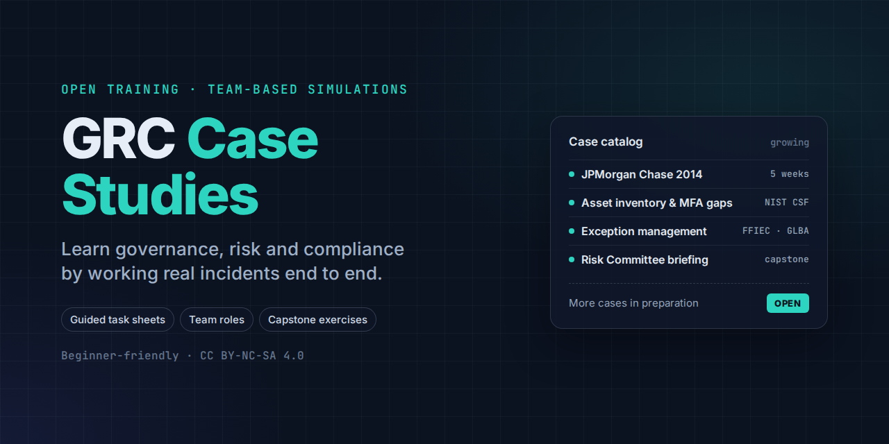

# GRC Case Studies

Open, team-based case studies for learning governance, risk and compliance (GRC) by doing it. Each case turns a real or realistic incident into a sequence of guided tasks: separating facts from assumptions, scoping assets and controls, writing and scoring risks, mapping to frameworks, planning remediation, monitoring, and briefing executives. Each ends in a capstone.

Written for GRC, IT audit and risk learners with little or no IT background. No technical configuration knowledge is required or tested.

## Case catalog

| Case | Topic | Frameworks | Format | Level |
|---|---|---|---|---|
| [JPMorgan Chase 2014](jpm-2014/) | A breach through one server left out of an MFA rollout; asset inventory, exception management and coverage assurance | NIST CSF, FFIEC, GLBA, OCC Heightened Standards | 5 weeks · 9 tasks · 6 roles · capstone tabletop and Risk Committee presentation | Beginner |

More cases are in preparation.

## How each case is organized

| | |
|---|---|
| `case-study.md` | The case narrative and analysis |
| `getting-started.md` | Team roles, schedule and how each week runs |
| `tasks/` | Weekly task sheets with objectives, questions, templates and self-checks |
| `capstone/` | The final exercise and presentation brief |
| `rubric.md` | How the work is graded |
| `dist/` | DOCX and PDF downloads |

## Using these materials

- **Self-study or study groups:** work through the tasks in order and check your work against the rubric.
- **Instructors and trainers:** each case includes a delivery plan and role model you can run as-is or adapt.

Case narratives are teaching adaptations of public reporting. Some details are simplified for classroom use, so check primary sources before citing specific facts. These materials are not affiliated with or endorsed by any organization named in them.

## Author and license

Created by [Girish Nair](https://github.com/garynair). Licensed under [CC BY-NC-SA 4.0](LICENSE): you may share and adapt these materials for non-commercial use with attribution, under the same license.
