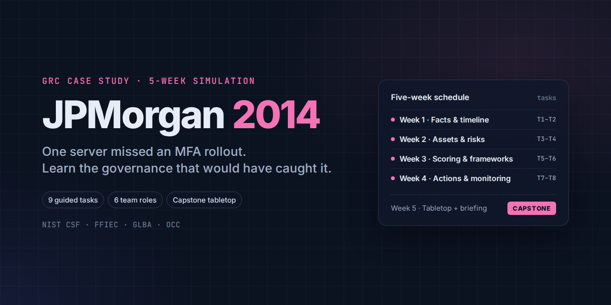

# JPMorgan Chase 2014: A GRC Case Study

*Part of [GRC Case Studies](../README.md).*

A five-week, team-based governance, risk and compliance (GRC) simulation built around the 2014 JPMorgan Chase data breach. Nine guided tasks take learners from case facts to a Risk Committee briefing, ending in a capstone tabletop exercise and final team presentation.

**The core lesson:** a well-funded security programme was breached through one internet-facing server that was left out of an enterprise two-factor authentication rollout. The failure was governance completeness (asset inventory, exception management, coverage assurance), not security technology.

**Who it's for:** GRC, IT audit and risk learners with little or no IT background. No technical configuration knowledge is required or tested.

## What's inside

| | |
|---|---|
| [Case study](case-study.md) | The breach narrative, GRC failure analysis, framework mapping, consequences and lessons |
| [Getting started](getting-started.md) | How to use the materials, the six team roles, the five-week schedule and how each week runs |
| [Glossary](glossary.md) | Plain-language definitions of every technical term used |
| [Tasks 1–8](tasks/) | Weekly task sheets with objectives, questions, templates and a self-check |
| [Capstone](capstone/) | Task 9 (incident tabletop and executive briefing) and the final team presentation brief |
| [Rubric](rubric.md) | How the work is graded |
| [Answer key](answer-key/) | Instructor guide, answer-key summary and model answers for Tasks 1–9 |
| [Downloads](dist/) | Student workbook, case study, instructor guide and model answers as DOCX and PDF |

## Five-week schedule

| Week | Tasks | Focus |
|---|---|---|
| 1 | Task 1 · Understand the case and learn the basic terms Task 2 · Build the incident timeline and identify stakeholders | Case facts, terminology, timeline and stakeholders |
| 2 | Task 3 · Create an asset inventory and define control scope Task 4 · Identify risks and write clear risk statements | Asset scope, control gaps and risk statements |
| 3 | Task 5 · Assess and prioritize the risks Task 6 · Map the gaps to GRC frameworks and requirements | Risk scoring, evidence and framework mapping |
| 4 | Task 7 · Design the corrective action and exception management plan Task 8 · Create KRIs, KPIs and an ongoing monitoring dashboard | Corrective actions, exceptions, metrics and escalation |
| 5 | **Capstone:** Task 9 · Conduct the incident tabletop and present to executives, plus the final team presentation | Tabletop, executive report and Risk Committee presentation |

Plan on about 13–15 hours of classroom time plus independent work. See [Getting started](getting-started.md) for how each week runs.

## Team roles

The simulation is designed for six learners, each owning one role: GRC Coordinator, Asset and Control Analyst, Risk Analyst, Compliance and Controls Analyst, Incident and Communications Analyst, and Internal Auditor / Quality Reviewer. Smaller teams can combine roles, but the Internal Auditor should stay independent of the work they review.

## Frameworks covered

NIST Cybersecurity Framework (CSF), FFIEC guidance, the GLBA Safeguards Rule, OCC Heightened Standards, and current SEC cybersecurity disclosure expectations.

## Answer key

The instructor guide, answer-key summary and model answers for all nine tasks are in [answer-key/](answer-key/). Learners: finish each task before opening its model answer.

## About the case

The case narrative is a teaching adaptation of public reporting on the 2014 breach. Some details are simplified for classroom use, so check primary sources before citing specific facts. This project is not affiliated with or endorsed by JPMorgan Chase & Co.

## Author and license

Created by [Girish Nair](https://github.com/garynair). Licensed under [CC BY-NC-SA 4.0](../LICENSE): you may share and adapt these materials for non-commercial use with attribution, under the same license.
